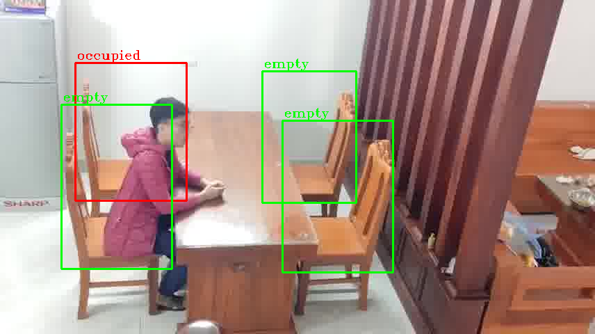
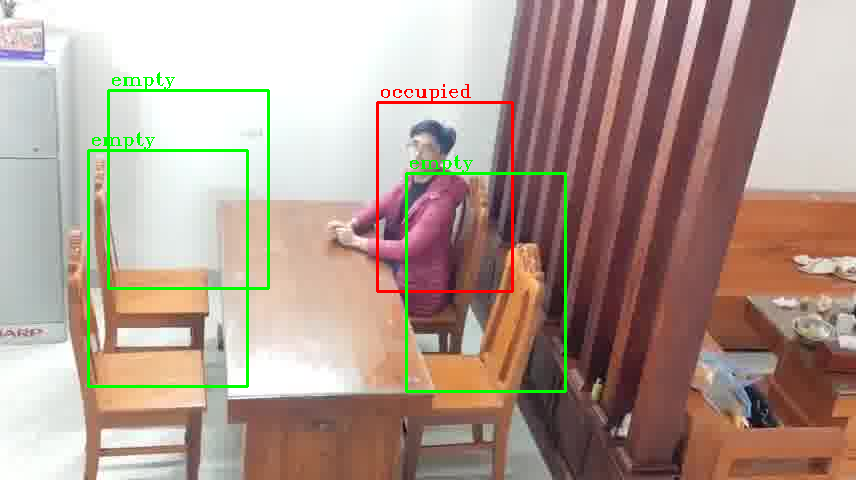
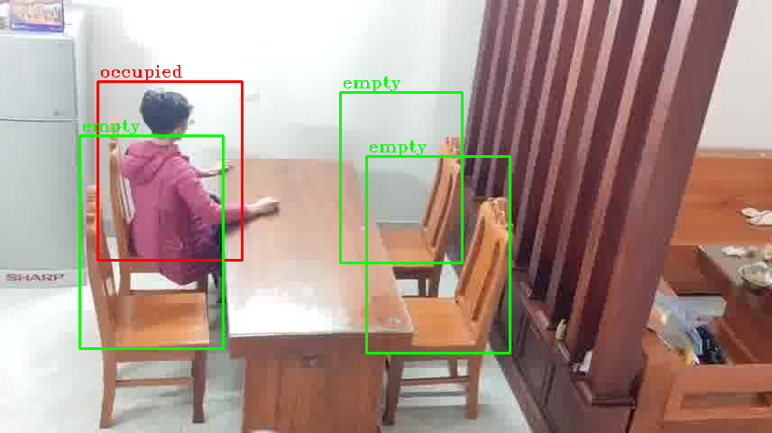

# Seat-Occupancy-Detection-YOLOv8

## **Built With**
- Python 3.11  
  

## **References**
- [J3lly-Been/YOLOv8-HumanDetection](https://github.com/J3lly-Been/YOLOv8-HumanDetection)  
- [TheBlackCat22/Seat-Occupancy-Detection](https://github.com/TheBlackCat22/Seat-Occupancy-Detection)  

---

This repository implements a lightweight seat occupancy detection system using a pre-trained YOLOv8 model.

## **Methodology**
### **1. Region of Interest (ROI):**
- Input images are resized and manually cropped to focus on regions of interest (ROIs), including smaller, detailed sub-ROIs.

### **2. Object Detection:**
- The pre-trained YOLOv8n model (`best.pt`), obtained from [J3lly-Been/YOLOv8-HumanDetection](https://github.com/J3lly-Been/YOLOv8-HumanDetection), is used to detect objects and humans within the ROIs corresponding to each chair in a processed frame.
  
- **Chair Status Determination**:
  - If nothing is detected then check on smaller ROIs.
  -  If the detection results include the value `0`, the corresponding chair is marked as "**occupied**".
  -  If `0` is not detected but other values are present:
        - Determine whether these values are unimportant. If they are, the chair is marked as "**empty**".
        - Otherwise, the chair is marked as "**occupied**".
- **Dataframe Output**:
  - Results are saved as a `.csv` file containing the following columns:
    - `Frame Number`
    - `Chair Number`
    - `Status` (`1` for **occupied**, `0` for **empty**)

---

This methodology was **significantly influenced** by the approach in [TheBlackCat22/Seat-Occupancy-Detection](https://github.com/TheBlackCat22/Seat-Occupancy-Detection) and builds upon it with some adjustments and optimizations.

---

## **Results**
Below are three sample processed frames from a handmade test dataset of a dining room:

  
  

